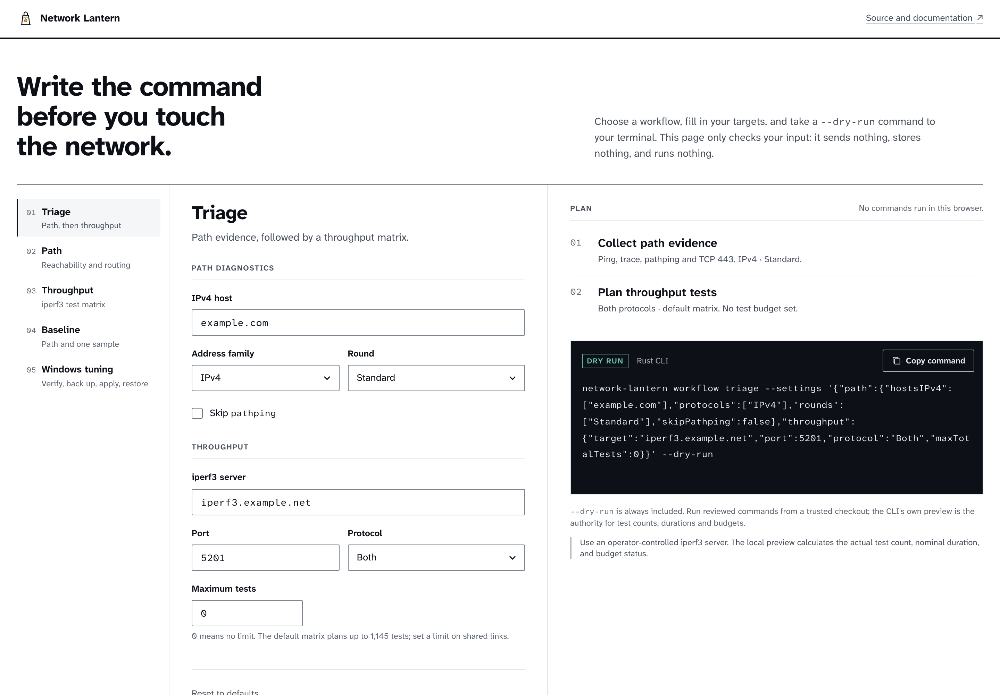
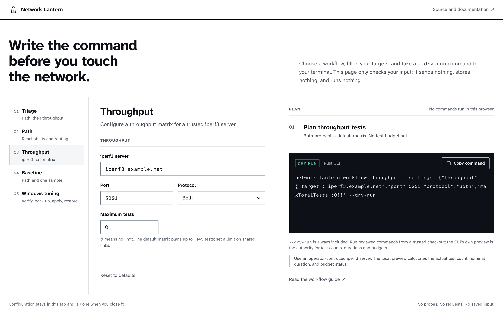
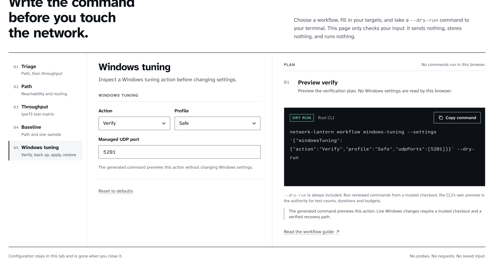
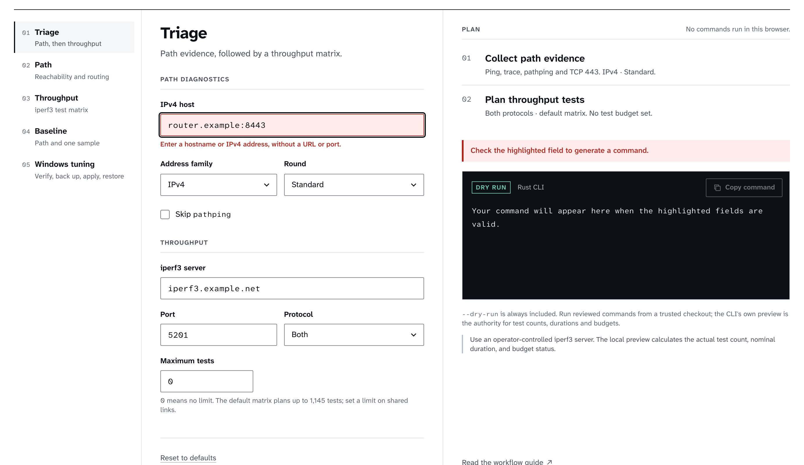
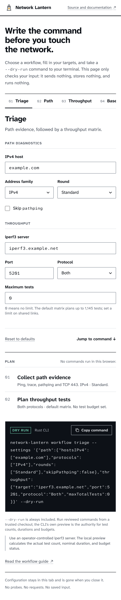

# Network Lantern

**Collect path and throughput evidence from a source checkout, and optionally inspect or change a limited set of Windows network settings.**

[](https://github.com/sebastianspicker/network-lantern/actions/workflows/ci.yml)
[](https://github.com/sebastianspicker/network-lantern/actions/workflows/rust.yml)
[](https://github.com/sebastianspicker/network-lantern/actions/workflows/pages.yml)




Network Lantern is built for operators who diagnose networks they are authorized
to test, and for maintainers who extend one capability at a time. Everything runs
locally: there is no hosted service, remote API, installer, container image, or
published package. Clone the repository and run the tools on the host you are
diagnosing.

> [!NOTE]
> This is an early alpha. `VERSION` reads `0.1.0-alpha.1`, and there is no
> release tag yet. Public parameters, module exports, profiles, result schemas,
> and paths can change before a stable release.

## What it does

Network Lantern is four independent diagnostic capabilities plus a planner:

- **Path** traces reachability and routing.
  - Windows: `ping`, `tracert`, optional `pathping`, and a TCP 443 check.
  - Linux/macOS: an `mtr` matrix driven by Bash 4+.
- **Throughput** runs TCP or UDP `iperf3` matrices, manages profiles, and
  compares summaries. A Windows Forms client is included.
- **Windows tuning** (optional) previews, backs up, applies, or restores a small
  set of Windows network settings. Real changes need elevation.
- **Static planner** (`site/`) generates dry-run commands in the browser. It is a
  preview surface only: it never runs probes, calls a service, or saves input.

The two path implementations are intentionally separate. They share a target
configuration file, but not a probe set, plan, or result schema.

## Screenshot tour

The planner is a static page. Pick a workflow, set a target, and copy a command
with `--dry-run` already included. Invalid hosts, ports, or budgets block
generation until you fix them. The full Triage view is shown at the top of this
page.

| Throughput matrix options | Windows tuning preview |
| --- | --- |
|  |  |

| Bad input is explained before a command is generated | The planner fits small screens |
| --- | --- |
|  |  |

A live copy is published to GitHub Pages by
[`.github/workflows/pages.yml`](.github/workflows/pages.yml) at
<https://sebastianspicker.github.io/network-lantern/>. Enable Pages once with the
GitHub Actions source in the repository settings; the workflow deploys on pushes
that touch `site/`. Run the planner locally with:

```bash
python3 -m http.server 8000 --bind 127.0.0.1 --directory site
```

Then open <http://127.0.0.1:8000/>. The planner is a convenience layer, not an
authority. Your local PowerShell preview remains the source of truth for test
counts, duration estimates, budget checks, and backup validation.

## Requirements

Every PowerShell entrypoint requires PowerShell 7.

| Task | Additional requirements |
| --- | --- |
| PowerShell path live run | Windows with `ping`, `tracert`, `pathping`, and `Test-NetConnection` |
| Bash path live run | Bash 4+, `mtr`, and `jq`; `column` unless `--no-summary` is used |
| Throughput live run | `iperf3` 3.7+ and a trusted or operator-controlled server |
| Throughput GUI | Windows Forms on Windows |
| Windows tuning verification | Windows networking cmdlets, including `Get-NetQosPolicy` |
| Windows tuning mutation | Windows, elevation, and an independent recovery method |
| Complete development gate | See the [toolchain](docs/TESTING.md#toolchain) and [native desktop prerequisites](docs/TESTING.md#rust-migration-gate) |

Inspect your environment without installing anything:

```powershell
pwsh -NoProfile -NonInteractive -File .\scripts\Test-Prerequisites.ps1
```

Add `-IncludeIperf3` when preparing a throughput host. The script checks that
`iperf3` is on `PATH`; the live command enforces the minimum version.

## Try it without touching the network

Keep the checkout layout intact, because the adapters load repository-relative
modules. Run these from the repository root. Every example below previews a plan
and is safe to run: no probe, no throughput load, and no tuning write.

Preview the umbrella triage workflow:

```powershell
pwsh -NoProfile -File .\Invoke-NetworkLantern.ps1 `
  -Workflow Triage -IperfTarget iperf3.example.net -DryRun
```

Preview a Windows path plan:

```powershell
pwsh -NoProfile -File .\apps\path\Test-NetworkPath.ps1 `
  -HostsIPv4 example.com -Protocols IPv4 -Rounds Standard -DryRun
```

Preview the Bash path plan:

```bash
./apps/path/test-network-path.sh \
  --hosts4 example.com --types ICMP4,TCP4 --rounds Standard --dry-run
```

Preview one throughput test:

```powershell
pwsh -NoProfile -File .\apps\throughput\Measure-NetworkThroughput.ps1 `
  -Target iperf3.example.net -SingleTest -WhatIf
```

Preview Windows tuning without elevation:

```powershell
pwsh -NoProfile -File .\apps\windows-tuning\Invoke-NetworkPathTuning.ps1 `
  -Action Apply -TuningProfile Safe -UdpPorts 5201 -DryRun -PassThru
```

`iperf3.example.net` is a reserved example host, not a live server. Replace it
with a trusted target before a live run. Throughput profile save and delete are
the one exception to preview safety: they write even when `-WhatIf` is supplied.

## Configuration and local state

- `config/hosts.conf` provides the default IPv4 and IPv6 targets for both path
  entrypoints. The checked-in targets are third-party public services. Review or
  replace them before a live run.
- `profiles/example-office.json` shows the root workflow profile format. Profiles
  are limited to 1 MiB. Explicit command-line parameters override profile values;
  unknown sections and keys warn and are ignored. Treat an externally supplied
  profile as control input: inspect its resolved targets and actions in a dry run
  before live execution.
- Direct throughput values resolve in this order: explicit command line, JSON
  configuration, named profile, then module defaults. Use `-StrictConfiguration`
  to reject unknown or invalid values.
- Direct throughput profiles default to `.iperf3/profiles.json`. Orchestrated
  throughput uses `profiles/throughput-profiles.local.json`.
- The Bash path command reads `LOG_DIR` and `MTR_TIMEOUT_SECONDS`; the per-command
  timeout defaults to 360 seconds.
- `NETWORK_LANTERN_INSTALL_MISSING_MODULES=1` lets the complete local gate install
  its pinned PowerShell modules for the current user. It never installs operating
  system packages.

Default output and mutable-state locations:

| Operation | Default location |
| --- | --- |
| Direct PowerShell or Bash path run | `~/logs` |
| Direct throughput run | `./logs` |
| Root workflow path and throughput artifacts | `artifacts/path` and `artifacts/throughput`, or the same children under `-OutRoot` |
| Direct throughput profile store | `.iperf3/profiles.json` |
| Root workflow throughput profile store | `profiles/throughput-profiles.local.json` |
| Windows tuning backup | `%ProgramData%\NetworkLantern`, or `-BackupFolder` |

> [!WARNING]
> Generated output can contain internal hostnames, addresses, routes, local
> paths, usernames, and machine details. Use an operator-controlled private
> output directory with appropriate filesystem permissions, and review every
> artifact before sharing it. Ignored files are not safe to publish by default.

## Capabilities and entrypoints

| Surface | Purpose | Runtime | Guide |
| --- | --- | --- | --- |
| `Invoke-NetworkLantern.ps1` | Compose `Triage`, `Path`, `Throughput`, `Baseline`, or `WindowsTuning` plans | PowerShell 7; runs trusted capability adapters in isolated child processes | [Architecture](docs/architecture.md#workflow-composition) |
| `apps/path/Test-NetworkPath.ps1` | Run Windows path probes | Windows for live runs; portable dry-run planning | [Path diagnostics](docs/workflows/diagnose-path.md) |
| `apps/path/test-network-path.sh` | Run an `mtr` matrix and write machine-readable and text logs | Bash 4+, `mtr`, and `jq`; independent of the PowerShell path tool | [Path diagnostics](docs/workflows/diagnose-path.md) |
| `apps/throughput/` | Run `iperf3` tests, manage profiles, compare summaries, or use the Windows Forms client | PowerShell 7 and `iperf3` 3.7+; GUI requires Windows | [Throughput diagnostics](docs/workflows/diagnose-throughput.md) |
| `apps/windows-tuning/Invoke-NetworkPathTuning.ps1` | Verify, preview, back up, apply, or restore supported Windows settings | Windows; real Backup, Apply, and Restore require elevation | [Windows tuning](docs/workflows/windows-tuning.md) |
| `site/` | Generate example commands in a static browser interface | Static HTML, CSS, and JavaScript; never runs probes or persists input | [Static planner](#screenshot-tour) |
| `crates/` and `desktop/` | Rust CLI and Tauri desktop under active migration | Rust 1.96.0; in development alongside the behavior reference | [Rust application](docs/RUST.md) |

The Rust CLI and desktop are being built alongside the existing implementation.
The existing code stays the behavior reference until the migration acceptance
checks pass, so treat the Rust surfaces as in-progress.

## Repository layout

| Path | Responsibility |
| --- | --- |
| `apps/` | Stable operator-facing adapters and workflow child transport |
| `src/bash/path/` | MTR path package, with `load.sh` as its only composition root |
| `src/powershell/path/` | Windows path module |
| `src/powershell/throughput/` | iperf3 module and public API |
| `src/powershell/windows-tuning/` | Optional Windows verification, backup, apply, and restore module |
| `src/powershell/workflow/` | Pure profile and ordered workflow-plan builder |
| `site/` | Static command planner |
| `scripts/` | Development, verification, and shell wrappers; not a product API |
| `tests/` | Capability behavior suites and repository architecture checks |
| `crates/`, `desktop/` | Rust workspace and Tauri desktop client (migration in progress) |

See [docs/architecture.md](docs/architecture.md) for component ownership,
dependency direction, runtime flows, and security boundaries.

## Development and testing

The authoritative gate is:

```bash
./scripts/ci-local.sh
```

It uses controlled fakes and dry-run paths rather than live probes or Windows
mutation; [docs/TESTING.md](docs/TESTING.md#the-complete-gate) lists its steps.

Narrower checks while iterating:

```bash
make lint
make test-bash
make test-pwsh
make test
```

There is no separate packaging, release, or deployment command. See
[docs/TESTING.md](docs/TESTING.md) for the exact gate, focused tests, CI coverage,
and known verification gaps. Contribution workflow and review requirements are in
[CONTRIBUTING.md](CONTRIBUTING.md).

## Documentation

- [Architecture](docs/architecture.md)
- [Testing and verification](docs/TESTING.md)
- [Rust application](docs/RUST.md)
- [Path diagnostics](docs/workflows/diagnose-path.md)
- [Throughput diagnostics](docs/workflows/diagnose-throughput.md)
- [Windows tuning](docs/workflows/windows-tuning.md)
- Migration from the
  [Network Diagnostics Suite](docs/migration/from-network-diagnostics-suite.md),
  [MTR suite](docs/migration/from-mtr-test-suite.md),
  [iperf3 suite](docs/migration/from-iperf3-test-suite.md), or
  [Windows tuning tool](docs/migration/from-windows-udp-jitter-optimization.md)
- [Security policy](SECURITY.md)
- [Changelog](CHANGELOG.md)

## Safety and operating limits

- Run diagnostics only against systems and services you are authorized to test.
  The default path configuration contacts public services.
- Throughput tests can consume substantial bandwidth. A default full matrix can
  plan up to 1,145 tests when `iperf3` supports bidirectional mode; preview and
  restrict the matrix first.
- Direct Linux and macOS throughput runs require `-SkipReachabilityCheck
  -DisableMtuProbe`. The root workflow does not expose those switches, so its live
  throughput steps currently require Windows.
- Real Windows tuning Backup, Apply, and Restore change system state. Run them
  only from a trusted checkout with a trusted executable search path. Their
  validation paths are tested, but an elevated apply-and-restore cycle has not
  been verified on a disposable Windows VM for this revision.

See [SECURITY.md](SECURITY.md) for the trust model and reporting process.

Network Lantern is licensed under the [MIT License](LICENSE).
