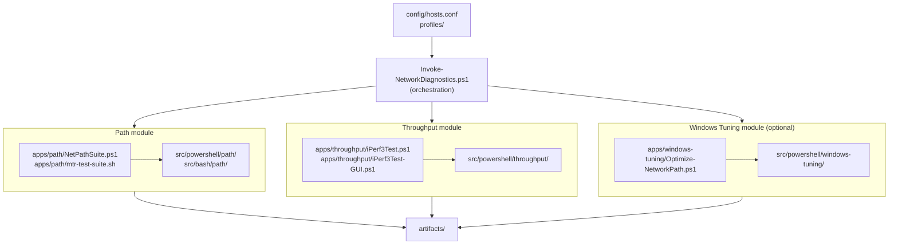

# Architecture

`network-diagnostics-suite` is organized by operator workflow rather than protocol or repo origin.

## Path

- entrypoints: `apps/path/mtr-test-suite.sh`, `apps/path/NetPathSuite.ps1`
- source anchors: `src/bash/path/`, `src/powershell/path/`
- purpose: route stability, reachability, latency, and probe planning

## Throughput

- entrypoints: `apps/throughput/iPerf3Test.ps1`, `apps/throughput/iPerf3Test-GUI.ps1`
- source anchor: `src/powershell/throughput/`
- purpose: `iperf3` TCP/UDP throughput, jitter, loss, thresholds, and regression tracking

## Windows tuning

- entrypoint: `apps/windows-tuning/Optimize-NetworkPath.ps1`
- source anchor: `src/powershell/windows-tuning/`
- purpose: optional conservative endpoint policy changes with backup and restore
- public module exports: `Invoke-NetworkPathTuning`, `Get-NdsDefaultBackupFolder`, `Test-UjIsAdministrator`
- legacy broad-tuning cmdlets are intentionally not exported

## Orchestration

- PowerShell workflow layer: `Invoke-NetworkDiagnostics.ps1`
- shell wrapper: `scripts/run-workflow.sh`
- artifact root: `artifacts/`
- shared host defaults: `config/hosts.conf`
- reusable workflow profiles: `profiles/`
