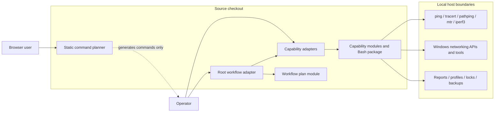
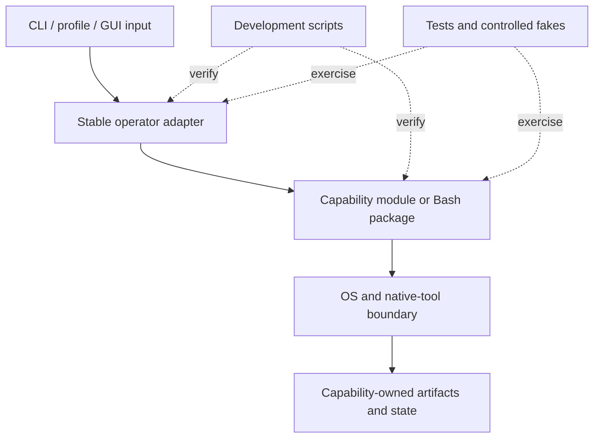
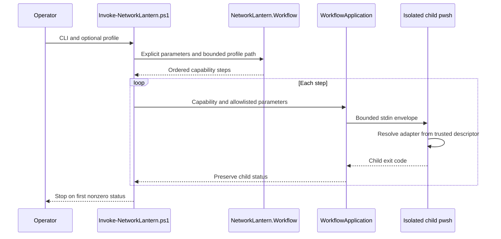
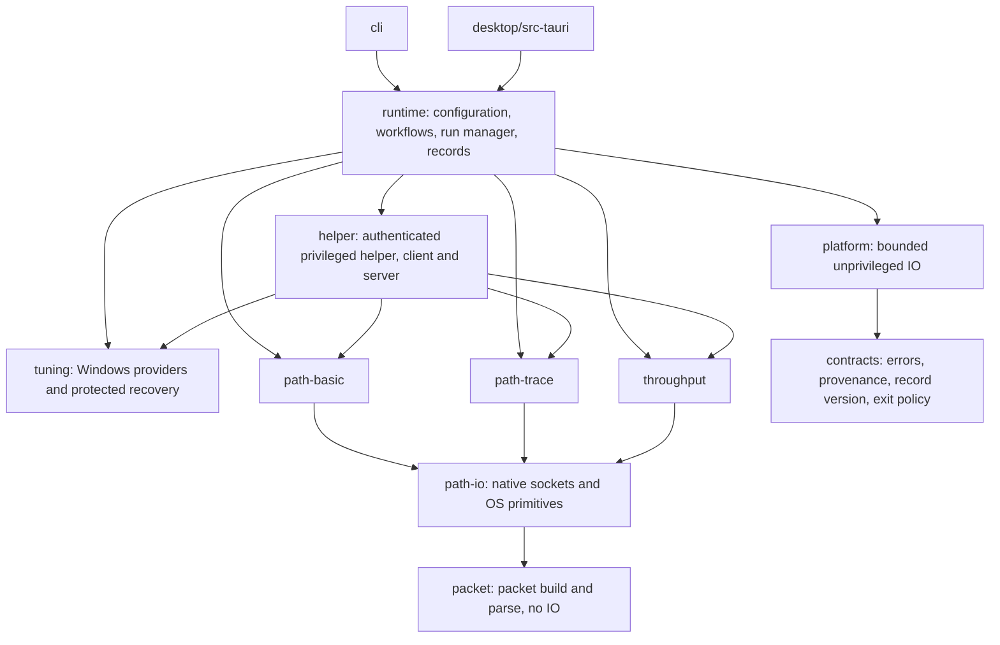

# Architecture

Network Lantern is a source-run network diagnostics toolkit. It is not a service,
an installable package, or a single network-probe framework. The repository holds
two implementations of the same capabilities, with a fixed relationship:

- The **Rust workspace and Tauri desktop** (`crates/`, `desktop/`) are the
  application under development. New behavior belongs there. See
  [Rust application boundaries](#rust-application-boundaries).
- The **PowerShell and Bash implementation** (`Invoke-NetworkLantern.ps1`,
  `apps/`, `src/`) is the behavior reference. It stays runnable and tested, and it
  is changed only for fixes, until the
  [archive trigger](#legacy-reference-and-archive-trigger) is met.

The static planner in `site/` belongs to neither: it only renders dry-run commands
for the Rust CLI.

Each implementation has four independent execution capabilities (two path
engines, throughput, and Windows tuning) that can be composed into an ordered
workflow. The capabilities share repository conventions but not a probe model or a
result schema. The sections up to [Trust and privilege
boundaries](#trust-and-privilege-boundaries) describe the legacy reference.

## System context

```mermaid
flowchart LR
    Operator[Operator]
    Browser[Browser user]

    subgraph Checkout[Source checkout]
        Root[Root workflow adapter]
        Apps[Capability adapters]
        Planner[Workflow plan module]
        Modules[Capability modules and Bash package]
        Site[Static command planner]
    end

    subgraph Host[Local host boundaries]
        Tools[ping / tracert / pathping / mtr / iperf3]
        Windows[Windows networking APIs and tools]
        State[Reports / profiles / locks / backups]
    end

    Operator --> Root
    Operator --> Apps
    Root --> Planner
    Root --> Apps
    Apps --> Modules
    Modules --> Tools
    Modules --> Windows
    Modules --> State
    Browser --> Site
    Site -. generates commands only .-> Operator
```

The browser planner is isolated from execution. Repository tests prohibit browser
networking and persistence APIs in `site/`, so the planner only renders dry-run
commands from in-memory input. `planner.js` owns pure validation and command and
step construction; `app.js` owns field state, accessible workflow navigation, and
explicit clipboard copying. Every generated command includes `--dry-run`, the
controls have no native form submission, and no input lands in URLs or browser
storage. The Rust capability planner remains the authority for generated CLI
counts, duration estimates, and execution validation.

## Components

| Component | Stable surface | Responsibility | Effects and state |
| --- | --- | --- | --- |
| Windows path | `apps/path/Test-NetworkPath.ps1` | Bind the CLI to `NetworkLantern.Path`; plan and invoke Windows path probes; aggregate status | Network probes; timestamped JSON and CSV under the selected log directory |
| MTR path | `apps/path/test-network-path.sh` | Bind the CLI to the explicitly loaded Bash package; validate and execute MTR plans | Sequential `mtr` children; JSON-object stream and text log |
| Throughput | `apps/throughput/Measure-NetworkThroughput.ps1` and GUI | Bind CLI or Windows Forms input to `NetworkLantern.Throughput`; plan and run iperf3 matrices; manage profiles and comparisons | `iperf3` children, reports, summary files, run index, profiles, locks, cancellation signal |
| Windows tuning | `apps/windows-tuning/Invoke-NetworkPathTuning.ps1` | Bind the CLI to `NetworkLantern.WindowsTuning`; verify, back up, apply, or restore a limited setting set | Windows registry, QoS, NIC and power-plan reads; optional privileged mutation; backup bundle |
| Workflow plan | `New-NetworkLanternWorkflowPlan` | Parse a bounded profile, resolve precedence, and return ordered capability steps | Reads profile input; creates no process or artifact |
| Workflow application | `Invoke-NetworkLantern.ps1` and `apps/workflow/Private/` | Map steps to trusted adapters and execute isolated children | Child PowerShell processes; child-owned artifacts and exit statuses |
| Static planner | `site/` | Validate input and render dry-run `network-lantern workflow` commands for the Rust CLI | Explicit clipboard copy only; no probes, service calls, files, or browser storage |

The PowerShell modules are source-loaded from manifests and are not published
as independent packages. Operator guides therefore document the stable app
surfaces rather than internal module installation.

## Dependency direction

```mermaid
flowchart TD
    Input[CLI / profile / GUI input]
    Adapter[Stable operator adapter]
    Boundary[Capability module or Bash package]
    Native[OS and native-tool boundary]
    Owned[Capability-owned artifacts and state]

    Input --> Adapter --> Boundary --> Native --> Owned

    Scripts[Development scripts]
    Tests[Tests and controlled fakes]
    Scripts -. verify .-> Adapter
    Scripts -. verify .-> Boundary
    Tests -. exercise .-> Adapter
    Tests -. exercise .-> Boundary
```

Product code does not depend on `scripts/`, and PowerShell modules do not depend on
`apps/` or import another module's `Private/` files. Module root files list their
private and public loaders explicitly, and every manifest export is defined under
`Public/`.

`src/bash/path/load.sh` is the only Bash composition root. Library files never
source one another, and `main.sh` owns CLI parsing and the application lifecycle.

The Windows and MTR path capabilities stay separate. They share the
`config/hosts.conf` target format, but their test matrices, platform requirements,
native tools, timeout behavior, and outputs differ in ways that matter. A common
path abstraction would erase those operational distinctions without providing a
stable shared contract.

## Principal runtime flows

### Windows path diagnostics

1. The adapter imports `NetworkLantern.Path` and forwards only bound parameters.
2. The module resolves explicit hosts before `config/hosts.conf`, validates
   output paths and selections, and builds protocol-by-round-by-host work.
3. `-DryRun` returns the plan and proposed output names without probing or
   creating directories.
4. A live run invokes `ping`, `tracert`, optional `pathping`, and
   `Test-NetConnection`, then derives per-stage and overall status.
5. The module persists JSON and CSV. If execution is interrupted after at
   least one result, it attempts to preserve the partial collection. Each file
   uses an exclusive sibling temporary file, flushed and closed before atomic
   replacement; a failed publication preserves the previous destination.
6. The adapter translates the returned run status into the process exit code.

### MTR path diagnostics

1. The shell adapter sources `load.sh`, which loads libraries and `main.sh` in
   an explicit order.
2. `path_main` parses the CLI, overlays explicit hosts on shared configuration,
   validates type and round selections, and creates the run matrix.
3. `--dry-run` prints planned commands without creating logs.
4. Live execution runs each `mtr` child sequentially. Each child has a bounded
   deadline with two 0.5-second polls per configured second, then TERM and KILL
   escalation with the existing 0.1-second grace checks.
5. Valid output is appended as one JSON object per run. Invalid or failed
   output becomes a bounded, parseable failure object. The log is a stream, not
   a JSON array.
6. Any planned-run failure produces process exit 1.

### Throughput

1. The CLI or GUI imports `NetworkLantern.Throughput`; neither imports module
   internals.
2. The module resolves defaults, named profile, JSON configuration, and
   explicit parameters in increasing precedence.
3. It validates target and matrix values and constructs TCP or UDP work using
   available local capability information. Live plans above an opt-in
   `MaxTotalTests` budget fail before connectivity checks or output creation.
   The default budget is `0` (unlimited), and retries do not count toward it.
4. `-WhatIf` reports the planned maximum, budget status, and nominal test
   seconds without connectivity checks or result writes, even over budget.
   Profile save and delete are separate explicit write operations.
5. Live execution validates prerequisites and connectivity, controls native
   processes, parses JSON output, applies thresholds, and writes result
   CSV/JSON, summary JSON, a Markdown report, and the run index. A private .NET
   asynchronous reader concurrently drains native streams, retaining at most
   1 MiB stdout and 64 KiB stderr. Overflow fails a measurement. After parsing
   metrics, raw diagnostics retain at most 16 KiB of UTF-8 text; shortening
   diagnostics alone does not fail a measurement.
6. Profile and run-index writes use sidecar locks and same-directory atomic
   replacement. GUI cancellation uses a bounded nonce- and run-ID-bound signal.
   Primary JSON/CSV/Markdown outputs also use exclusive sibling temporary
   files, flushed and closed before atomic publication. Atomicity is per file,
   not a transaction across the run's artifacts.
7. The Windows Forms adapter keeps layout and presentation helpers in
   `apps/throughput/Private/`. It checks editable text before entering its busy
   state, displays module-owned preview totals, and marks estimates stale when
   inputs change. Preview and live execution share the existing asynchronous
   job lifecycle and cancellation transport; the GUI does not calculate a
   separate test plan.

### Windows tuning

1. The adapter imports `NetworkLantern.WindowsTuning`, invokes the selected
   action, and maps its structured `Success` field to process status.
2. `Verify` reads local QoS enablement and requested managed policies.
3. `-DryRun` builds and reports a plan without elevation or state writes. Some
   hardware- and application-path checks are deferred until live execution;
   a successful preview is not proof that a change can be applied.
4. Real Backup, Apply, and Restore require Windows and elevation.
5. Apply creates a backup and verifies the manifest, expected artifacts,
   digests, and path trust before the first tuning mutation.
6. Restore validates compatibility and bounded component schemas, copies
   approved artifacts into protected staging, and revalidates staging before
   each consumer. A failed managed-QoS inventory returns component status
   `Warn`, performs no QoS creation or removal, and makes the public restore
   result unsuccessful.

Legacy backup locations, manifest schemas, and managed QoS prefixes are
accepted only for recoverability. They do not define naming or storage
conventions for new features.

## Workflow composition

The root workflow separates pure planning from repository-aware execution:

```mermaid
sequenceDiagram
    participant O as Operator
    participant R as Invoke-NetworkLantern.ps1
    participant P as NetworkLantern.Workflow
    participant A as WorkflowApplication
    participant C as Isolated child pwsh

    O->>R: CLI and optional profile
    R->>P: Explicit parameters and bounded profile path
    P-->>R: Ordered capability steps
    loop Each step
        R->>A: Capability and allowlisted parameters
        A->>C: Bounded stdin envelope
        C->>C: Resolve adapter from trusted descriptor
        C-->>A: Child exit code
        A-->>R: Preserve child status
    end
    R-->>O: Stop on first nonzero status
```

`NetworkLantern.Workflow` reads a UTF-8 JSON object limited to 1 MiB, warns on
unknown sections or keys, and resolves effective values in the order explicit CLI,
profile, then defaults. It has no repository-root knowledge and starts no
processes. Before building child steps, it validates resolved values against
parameter types, allowed values, and ranges. The root parameter
`ThroughputMaxTotalTests` and profile key `throughput.maxTotalTests` map to the
trusted throughput adapter parameter `MaxTotalTests`.

`apps/workflow/Private/WorkflowApplication.ps1` owns a single descriptor table that
maps a capability to a repository-relative adapter and its allowed child
parameters. The child envelope carries only the capability name and parameter
values, never `ScriptPath`, `AdapterPath`, or another executable path. The child
reads at most the 1 MiB limit plus one byte, validates the same descriptor,
resolves the trusted adapter locally, and invokes it.

Child isolation keeps one capability's module state, terminating errors, or process
exit behavior from contaminating another step. The root adapter stops on the first
nonzero child status and returns that status unchanged. Bootstrap, binding, and
invocation errors terminate with failure, and successful adapters do not depend on
an existing native exit-code variable.

## Configuration and state ownership

| Input or state | Owner | Contract |
| --- | --- | --- |
| `config/hosts.conf` | Both path adapters | Shared target input only; explicit hosts take precedence |
| `profiles/example-office.json` schema | Workflow plan module | Bounded profile; CLI overrides profile; unknown keys warn and are ignored |
| Direct throughput configuration and profiles | Throughput module | CLI > JSON configuration > named profile > defaults; mutable store is locked and atomically replaced |
| Root workflow throughput profile | Workflow application and throughput module | Fixed local store under `profiles/` unless the implementation contract changes |
| Path and throughput artifacts | Owning capability | Written only below the selected output root during live execution |
| Tuning backups | Windows tuning module | Separate from workflow artifact roots; trusted-path and manifest rules apply |
| Rust host layer | `runtime` (`local_config`) | `config/hosts.conf` is read relative to the launch directory and snapshotted per reviewed run; when it is absent, the built-in engine defaults apply |
| Rust profile store | `runtime` (`profiles`) | Defaults to `.iperf3/profiles.json` relative to the launch directory; reads legacy profile names and keys without rewriting them |
| Rust run records | `runtime` (`execution`, `reports`) | `logs/<run-id>/` by default: versioned summary plus separately published measurements |

Preview modes may read configuration and validate inputs, but they create no
result or tuning state. Throughput profile save and delete stay explicit
exceptions, because profile management is the requested operation.

Profiles and configuration are control input, not authorization. Operators must
review resolved targets and actions before live execution, and must keep output
directories and backup namespaces under their control with appropriate filesystem
permissions.

## Trust and privilege boundaries

Network Lantern has no application authentication or authorization layer. The
operating-system identity, elevation state, target authorization, and local
filesystem permissions govern its effects.

- Native tools receive argument arrays rather than interpolated command
  strings, but executable resolution still depends on the host environment.
- Elevated tuning executes repository-local modules and PATH-resolved tools.
  Use a trusted checkout and executable search path before elevation.
- The workflow descriptor and bounded child envelope prevent a profile from
  selecting an arbitrary adapter. They do not authorize the profile's targets
  or requested mutation.
- Diagnostic output, profiles, and backups can disclose internal network and
  host details. Use private output roots and review artifacts before sharing.
- Backup digests detect changes inside a bundle; they do not authenticate the
  bundle's creator. Restore only state with independently trusted provenance.

See [SECURITY.md](../SECURITY.md) for reporting and operator guidance.

## Build and deployment boundaries

There is no compile or packaging stage for the legacy tools. Operator adapters
and modules run from the checkout; the private throughput reader is compiled once
per PowerShell process when loaded. CI runs the cross-shell gate on Ubuntu and the
PowerShell gate on Windows. Node.js 22+ is a development-only prerequisite for the
static planner tests. The static planner is served as ordinary files, and
`.github/workflows/pages.yml` publishes `site/` to GitHub Pages.

## Invariants and extension points

- Put behavior in the capability that owns its input, effects, and artifacts.
- Add shared code only for a concept with identical semantics across
  capabilities.
- Add public PowerShell commands under `Public/`, declare them in the manifest,
  and include them in the explicit loader inventory.
- Add Bash behavior through a focused library loaded by `load.sh`; do not add
  another composition root.
- Add workflow capabilities only by extending the pure plan schema, trusted
  descriptor table, parameter allowlist, child tests, and operator docs
  together.
- Do not add browser execution, networking, or persistence to `site/`.
- Preserve output schemas, exit codes, locking, cancellation, timeout, backup,
  and restore compatibility unless a deliberate external change is documented.

Architecture rules are enforced mechanically:

- `tests/architecture/RepositoryArchitecture.Tests.ps1` (Pester): stable legacy
  adapters, module and Bash loader rules, manifest/export agreement, dependency
  direction, workflow separation, the static planner boundary, and the exact set
  of executable files in Git.
- `tests/architecture/rust-boundaries.test.cjs` (Node): the exact internal crate
  dependency edges, engines spawn no CLI tools, packet parsing stays free of IO, the planner has no persistence, and the
  production desktop grants no test permissions.
- `tests/architecture/default-hosts.test.cjs` (Node): the default path targets
  agree across `config/hosts.conf`, both legacy path engines, and both Rust path
  engines.

The complete validation command is documented in [TESTING.md](TESTING.md).

## Rust application boundaries

Crates depend in one direction, from vocabulary to engines to the application
facade to adapters. Cargo only rejects cycles, so
`tests/architecture/rust-boundaries.test.cjs` lists every allowed internal edge
and fails on any other.

```mermaid
flowchart TD
    cli[cli]
    desktop[desktop/src-tauri]
    runtime[runtime: configuration, workflows, run manager, records]
    helper[helper: authenticated privileged helper, client and server]
    tuning[tuning: Windows providers and protected recovery]
    basic[path-basic]
    trace[path-trace]
    throughput[throughput]
    pathio[path-io: native sockets and OS primitives]
    packet[packet: packet build and parse, no IO]
    platform[platform: bounded unprivileged IO]
    contracts[contracts: errors, provenance, record version, exit policy]

    cli --> runtime
    desktop --> runtime
    runtime --> helper
    runtime --> tuning
    runtime --> basic
    runtime --> trace
    runtime --> throughput
    runtime --> platform
    helper --> tuning
    helper --> basic
    helper --> trace
    helper --> throughput
    basic --> pathio
    trace --> pathio
    throughput --> pathio
    pathio --> packet
    platform --> contracts
```

For readability the diagram omits edges to the leaf crates that most crates use
directly: `contracts` (throughput, helper, runtime, cli, desktop), `packet`
(path-basic, path-trace, throughput, runtime), `path-io` (helper, runtime), and
`platform` (cli, for bounded settings reads).

- `crates/contracts` is the shared vocabulary: `ErrorCategory`, `Error`,
  `Provenance`, `RECORD_VERSION`, and the `exit` module. `exit` is the only place
  that defines process statuses (throughput's `11`–`16` table, `1` for other
  capabilities, `130`/`143` for interruption) and how a failure category maps to
  them.
- `crates/platform` owns bounded unprivileged data IO and atomic publication.
- `crates/packet` owns packet construction and parsing without IO.
- `crates/path-io` owns shared native socket and OS primitives.
- `crates/path-basic`, `crates/path-trace`, and `crates/throughput` own separate
  measurement plans, engines, and result semantics.
- `crates/runtime` is the application facade that both adapters use:
  - `request` parses a request into a typed capability (a leaf module);
  - `application` builds plans, layers workflow steps, and supplies `workflow`
    with its throughput validator;
  - `workflow` resolves an ordered workflow without depending on planning;
  - `execution` runs a reviewed request and writes the versioned summary;
  - `profiles` owns profile stores;
  - `reports` reads, normalizes, pages, lists, compares, and exports records in
    one submodule per concern. Readers accept the explicit
    `SUPPORTED_RECORD_VERSIONS` range, which a test ties to `RECORD_VERSION`,
    and reject other versions explicitly;
  - `errors` maps engine, helper, and tuning errors to the shared taxonomy;
  - `manager` holds the single active run and derives its `RunState`.

  Only `manager`, `profiles`, `reports`, and the planning and execution entry
  points are public; the other modules are crate-private.
- `crates/cli` is an operator adapter: argument parsing, output, and signal
  handling only.

Rust plans run without DNS, sockets, helper authorization, or result writes.
Execution records include the engine and version, and legacy profiles and reports
are read and normalized without rewriting their sources or supplying absent
metrics. Wire names shared with the desktop (`RunState`, `ErrorCategory`) are
pinned by `tests/fixtures/contracts/wire-enums.json`, which a runtime test and a
desktop unit test both check.

The helper client and server stay in one crate because they share the protocol
and the per-platform transports; splitting them would move Windows and macOS
transport code without a behavior or dependency benefit.

`crates/helper` independently validates authenticated bounded requests, binds
operations to reviewed hashes and run IDs, rejects replay, and cancels probe work
after a client disconnects. Its transports are Windows named pipes, Linux Unix
sockets, and macOS XPC. `crates/tuning` owns Windows provider calls and protected
recovery, and the generic data IO crate does not authorize privileged filesystem or
registry operations.

`desktop/src-tauri` exposes typed commands, and `desktop/src` presents those results
without shell or executable inputs. The frontend is plain TypeScript: `markup.ts`
holds the static page structure, `state.ts` the explicit view state, `model.ts`
and `render.ts` the pure, unit-tested request and presentation logic, and one
module per concern (`plan`, `run`, `measurement`, `profiles`, `reports`,
`library`, `runtime`, `navigation`, with `dom.ts` helpers) wires events to Rust commands through `bridge.ts`.

The presentation layer owns request freshness for profile editors and report
selections; asynchronous responses update only
their originating view state. Profile writes are serialized in the UI and retain
the store/name captured at submission, while the runtime remains the authority
for validation and persistence. Resolved native path host lists retain explicit
empty families through planning and profile reloads.

Test-only WebDriver plugins sit behind the `e2e` feature, while production defaults embed local frontend assets through
Tauri's custom protocol. Native window-close and application-exit requests cancel
active measurements before exit; a five-second cleanup timeout leaves the window
open with cancellation state visible, and new measurements and helper changes are
rejected while shutdown is pending.

## Legacy reference and archive trigger

The PowerShell and Bash implementation remains because the Rust native path,
helper, and Windows tuning behavior has not been verified on matching hosts:
elevated Windows apply and restore, SCM/UAC/named-pipe helper authentication,
Linux polkit and service operation, signed macOS helper registration, and live
raw-socket probing. Archive the legacy tree (`Invoke-NetworkLantern.ps1`, `apps/`,
`src/`, their tests and `scripts/ci-legacy.sh`) once those checks pass on matching
hosts and the operator guides in `docs/workflows/` describe the Rust surfaces.

Until then the legacy code is maintained for fixes only. Known structural debt is
left in place deliberately, because restructuring would put the reference behavior
at risk for code that is scheduled for removal:

- The throughput GUI's cancellation protocol is split between
  `apps/throughput/Private/GuiRunLifecycle.ps1` and the module's
  `Private/NativeProcess.ps1`.
- The throughput CLI adapter repeats module helpers for path containment, exit
  codes, and profile-name validation.
- Workflow parameter names and defaults are repeated in `Invoke-NetworkLantern.ps1`,
  the workflow plan module, and the descriptor table in
  `apps/workflow/Private/WorkflowApplication.ps1`. The architecture test checks
  only that the root adapter and plan module parameters agree.

## Repository layout

The top-level split (`crates/` and `desktop/` for Rust, `apps/` and `src/` for the
legacy reference, `site/`, `tests/`, `scripts/`) follows the two-implementation
model. A capability-first layout was rejected. It would have rewritten about 100
path references in tests, scripts, docs, and CI for the legacy tree without
changing behavior, and that tree is scheduled for archival.
