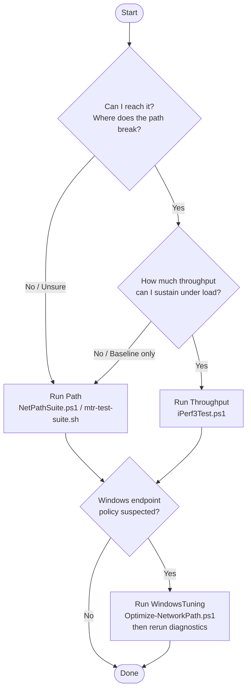

# Decision Tree

## Start here

1. If the question is "can I reach it and where does the path break?", use `Path`.
2. If the question is "how much throughput can I sustain under load?", use `Throughput`.
3. If Windows endpoint policy might be hurting results, use `WindowsTuning` after diagnostics, not before by default.

## Suggested flow

- first-pass issue triage: `Triage`
- route instability or packet loss: `Path`
- performance baseline or saturation test: `Throughput`
- before/after endpoint comparison on Windows: `WindowsTuning` plus rerun diagnostics
